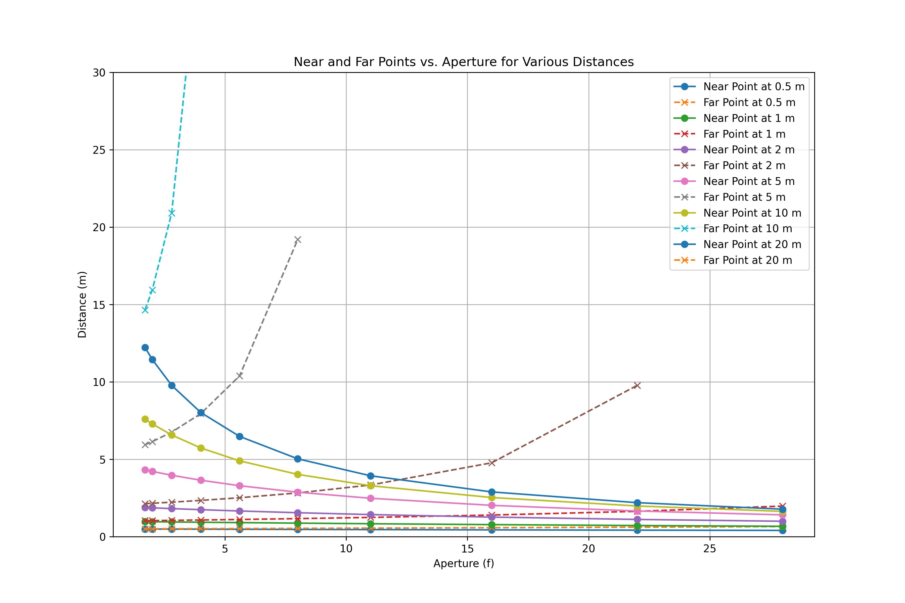

### Near Points (m):

|   Distance (m) |   1.7 |   2.0 |   2.8 |   4.0 |   5.6 |   8.0 |   11.0 |   16.0 |   22.0 |   28.0 |
|---------------:|------:|------:|------:|------:|------:|------:|-------:|-------:|-------:|-------:|
|            0.5 |  0.49 |  0.49 |  0.49 |  0.48 |  0.48 |  0.47 |   0.46 |   0.44 |   0.42 |   0.4  |
|            1   |  0.97 |  0.97 |  0.95 |  0.93 |  0.91 |  0.87 |   0.84 |   0.78 |   0.72 |   0.67 |
|            2   |  1.88 |  1.86 |  1.81 |  1.74 |  1.66 |  1.55 |   1.43 |   1.26 |   1.11 |   1    |
|            5   |  4.32 |  4.22 |  3.97 |  3.65 |  3.29 |  2.87 |   2.48 |   2.02 |   1.66 |   1.41 |
|           10   |  7.59 |  7.28 |  6.57 |  5.73 |  4.9  |  4.02 |   3.29 |   2.53 |   1.98 |   1.63 |
|           20   | 12.23 | 11.45 |  9.78 |  8.02 |  6.48 |  5.03 |   3.93 |   2.89 |   2.2  |   1.78 |

### Far Points (m):

|   Distance (m) |   1.7 |   2.0 |    2.8 |    4.0 |    5.6 |    8.0 |   11.0 |   16.0 |   22.0 |   28.0 |
|---------------:|------:|------:|-------:|-------:|-------:|-------:|-------:|-------:|-------:|-------:|
|            0.5 |  0.51 |  0.51 |   0.51 |   0.52 |   0.53 |   0.54 |   0.55 |   0.58 |   0.61 |   0.65 |
|            1   |  1.03 |  1.04 |   1.05 |   1.08 |   1.11 |   1.17 |   1.24 |   1.4  |   1.64 |   1.97 |
|            2   |  2.13 |  2.16 |   2.23 |   2.34 |   2.52 |   2.83 |   3.34 |   4.77 |   9.77 | inf    |
|            5   |  5.94 |  6.14 |   6.76 |   7.95 |  10.39 |  19.2  | inf    | inf    | inf    | inf    |
|           10   | 14.64 | 15.95 |  20.91 |  39.18 | inf    | inf    | inf    | inf    | inf    | inf    |
|           20   | 54.86 | 79.17 | inf    | inf    | inf    | inf    | inf    | inf    | inf    | inf    |

### Plot:

**Near and Far Points Plot**

